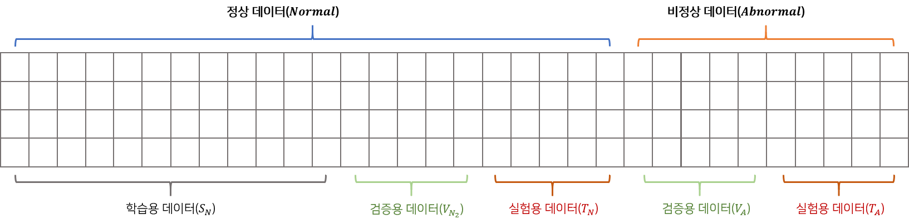

# Deep Learning Anomaly Detection
이 프로젝트는 종합화학 공정의 **고장 진단 및 사전 관리**를 위하여 딥러닝 방법론을 활용하여 Anomaly Detection을 수행한 결과물입니다.
Anomaly Detection 모델로 Variational Auto-Encoder, Auto-Encoder, LSTM based Auto-Encoder를 포함하고 있습니다.

### Description
일반적으로 Anomaly Detection에 활용하는 데이터는 정상 데이터가 풍부하고 이상 데이터가 적은 unbalanced class 데이터 입니다.
따라서 이 프로젝트에서는 정상데이터만으로 학습하고 이상치를 탐지하는 Unsupervised 방법론을 활용합니다.

### Data Split
모델을 학습 및 추론으로 활용하기 전에 데이터를 학습용, 검증용 테스트용으로 분할해야 합니다.
학습용 데이터에는 이상치가 없는 정상용 데이터만을 포함하고 있습니다.
검증용 데이터는 학습이 원할이 이루어지고 있는지 확인하기 위한 목적으로 정상용 데이터를 활용합니다.
또한 이상치를 잘 탐지하는지에 대해 확인하기 위하여 검증용 데이터는 이상 데이터도 포함하고 있습니다.
테스트 데이터는 학습과 검증에서 활용하지 않은 데이터를 활용하여 모델이 잘 작동하는지 확인합니다.


### Training Process

이상치가 없는 정상용 데이터만을 사용하여 모델을 학습합니다.
정상 데이터로 학습된 모델은 정상 데이터에 대한 패턴을 학습하여 잘 복원하지만 비정상 데이터는 잘 복원하지 못하므로 이를 활용하여 Anomaly Detection을 수행합니다.


#### LSTM-AE
```python
./run_lstm_ae.sh
```

### Inference Process


### Reference
- [[GITHUB]](https://github.com/AntixK/PyTorch-VAE) PyTorch VAE
